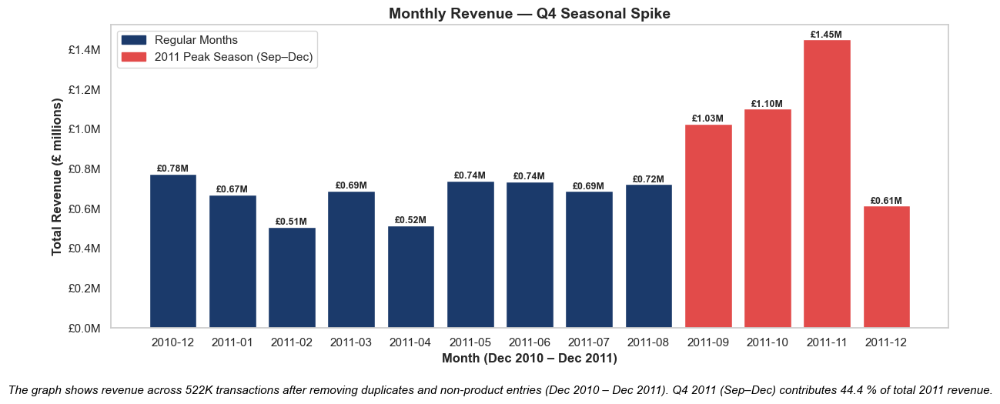

# 🛍️ Online Retail Intelligence: End-to-End Customer & Revenue Analytics

<p align="center">
  
  
  
  
  
</p>

**Analyst:** Swathi Anilkumar Sreelatha  
**Dataset:** UCI Online Retail | 522,360 transactions | Dec 2010 – Dec 2011 | 38 Countries  
**Tools:** Python · MySQL 8.0 · Excel · Power BI · scikit-learn


## Business Problem

A UK-based online retailer operating across **38 international markets** generates **£10.24M in annual revenue** ,  yet has no visibility into which customers drive that revenue, when and why they churn, which products to bundle, or what next quarter's sales will look like.

This project solves all of that. It delivers a **complete, production-grade business intelligence pipeline** covering every layer of the analytics stack: raw data cleaning in Excel, SQL-based business querying with window functions, Python-driven EDA and machine learning, and Power BI dashboarding, with every finding translated into a concrete, prioritised business recommendation.


## Key Results at a Glance

| Metric | Value |
|--------|-------|
| Total Revenue Analysed | £10.24M |
| Transactions Processed | 522,360 (after cleaning) |
| Duplicate Records Removed | 5,227 |
| Countries Covered | 38 |
| Customer Segments Identified | 4 (Champions, Loyal, At-Risk, Hibernating) |
| Q4 Revenue Contribution | 44.4% of full-year 2011 revenue |
| Guest Revenue at Risk | £1.51M (14.7% of total) |
| Forecast Model R² Score | 0.894 (89.4% variance explained) |
| Revenue Risk from 10% Champion Churn | ~£163,000 |


## Repository Structure

```text
online-retail-intelligence/
│
├── README.md
├── .gitignore
│
├── notebooks/
│   └── retail_analysis.ipynb
│
├── sql/
│   └── retail_analysis.sql
│
├── report/
│   └── retail_analysis.pdf
│
├── images/
│   ├── 01_Total_revenue.jpg
│   ├── 02_revenue_split.jpg
│   ├── 03_Executive_summary.png
│   ├── 04_customer_intelligence.png
│   └── 05_product_performance.png
│
└── data/
    └── README.md
```
##  Full Analysis Breakdown

### Stage 1 — Data Cleaning & Validation (Excel + Python)

The raw UCI dataset required structured cleaning before any analysis was possible. This was performed in two stages:

**In Excel:**
- Identified and removed cancelled transactions (Invoice_no prefixed with `'C'`)
- Removed zero-price and negative-price entries that distort revenue calculations
- Engineered four derived columns: `Total_revenue` (Quantity × Unit_price), `Month_name`, `Year`, and `Customer_segment` (Identified vs Guest — based on whether Customer_ID is populated)
- Replaced country code `'EIRE'` with `'Ireland'` for consistency across joins and reports

**In Python:**
- Loaded the cleaned sheet using `openpyxl` engine via `pandas.read_excel()`
- Stripped whitespace from all column names to prevent silent key errors downstream
- Detected and removed **5,227 fully duplicated transaction rows** — treated as system-generated duplicates given the presence of Invoice_no identifiers
- Validated final row count: **522,360 rows** confirmed after deduplication
- Removed non-product operational entries: `POSTAGE`, `BANK CHARGES`, `MANUAL`, `CARRIAGE`, `AMAZON FEE`, `DOTCOM` — these are back-office records that inflate product revenue tables if left in

> This integrated validation approach — checking duplicates, nulls, and dataset shape inline at each stage — reflects how production pipelines are built. Results are validated at every step rather than in an isolated QA block.

### Stage 2 — Revenue Analysis

Three core business questions answered:

**When does revenue peak?**



Revenue rises steeply from September 2011, peaking at approximately **£1.5M in November 2011**. Q4 2011 (Sep–Dec) alone accounts for **44.4% of full-year 2011 revenue** — a concentration that carries significant operational risk if inventory or logistics are not prepared in advance.

**Which markets matter most?**


The UK dominates, contributing the vast majority of total revenue. Among international markets, **Netherlands (£285K)** and **Germany (£229K)** represent the strongest growth opportunities. Each bar label shows both the absolute revenue value and percentage share of total — making the chart immediately usable in an executive presentation.

**Which products drive the most revenue?**


The top 10 products are dominated by decorative and gift items — consistent with a retailer serving both retail consumers and wholesale buyers. Each product bar includes its percentage share of total £10.24M revenue for immediate commercial context.


### Stage 3 — RFM Customer Segmentation (K-Means Clustering)

RFM (Recency, Frequency, Monetary) analysis is the industry-standard framework for customer value segmentation. Each customer is scored across three dimensions:
- **Recency** — days since last purchase (lower = more valuable)
- **Frequency** — number of unique orders placed
- **Monetary** — total spend across the full dataset period

**Implementation steps:**
1. Calculated RFM metrics per customer using `groupby` and lambda aggregation on `Invoice_date`, `Invoice_no`, and `Total_revenue`
2. Standardised all three metrics using `StandardScaler` — critical to prevent the monetary dimension from dominating the Euclidean distance calculations in K-Means
3. Applied the **Elbow Method** (k=1 to 10, plotting inertia at each step) to determine the optimal cluster count — confirmed at **k=4**
4. Ran `KMeans(n_clusters=4, random_state=42)` and mapped clusters to business segment names based on relative centroid positioning in Recency and Monetary space


**Segment outcomes:**

| Segment | Customers | Avg Spend | Profile |
|---------|-----------|-----------|---------|
| Champions | 13 | £125,707 | Wholesale / B2B accounts |
| Loyal Customers | — | High | Frequent retail buyers |
| At-Risk | — | Moderate | Declining engagement |
| Hibernating | — | Low | Inactive, minimal revenue |

> **Critical analytical note:** The Champion segment (13 accounts, avg spend £125,707) is not a retail loyalty cohort — it is a **wholesale/B2B segment**. Average basket sizes of 4,226 items per order and individual account spend between £168K–£279K confirm procurement-cycle purchasing, not consumer behaviour. Applying loyalty programmes or discount campaigns to these accounts would be commercially inappropriate. They require dedicated account management, volume-based pricing, and supply reliability — not retail CRM tools.

### Stage 4 — Cohort Retention Analysis

Cohort analysis groups customers by their **first purchase month** and tracks what percentage return in each subsequent month. This is the most direct measure of customer loyalty available from transaction data alone.

**Implementation:**
- Calculated each customer's `CohortMonth` using `groupby + transform('min')` on Invoice_date
- Derived `CohortIndex` (months since first purchase) using year/month integer arithmetic
- Built a pivot table counting unique Customer_IDs per cohort per period using `aggfunc='nunique'`
- Divided each row by its Month-0 baseline to convert counts into retention percentages
- Rendered as a `seaborn` heatmap — darker blue = stronger retention


**Key finding:** The **December 2010 cohort** is the strongest performer, maintaining ~30% retention at Month 6 and ~50% at Month 12. Most later cohorts drop below 25% within the first few months — the majority of customers are **one-time buyers who never return**.

This is a structural weakness in post-purchase engagement, not an acquisition problem. The business can generate first purchases efficiently, but lacks the lifecycle infrastructure to convert them into long-term customer relationships.

### Stage 5 — Basket Analysis by Customer Segment

Average items per order broken down by RFM segment — validates the B2B nature of Champions and quantifies the cross-sell opportunity in the retail base.

| Segment | Avg Items per Order | Interpretation |
|---------|-------------------|----------------|
| Champions | 4,226 | Bulk procurement orders |
| Loyal Customers | 698 | Strong retail basket |
| At-Risk | 233 | Mid-tier retail |
| Hibernating | 183 | Minimal engagement |

The 23× difference in basket size between Champions and Hibernating customers confirms that uniform marketing strategies across all segments would be both commercially ineffective and a waste of budget.

**Revenue concentration risk quantified:**
A 10% churn rate across the 13 Champion accounts would result in an estimated **£163,000 revenue loss** (13 × 10% × £125,707 avg spend). This figure alone makes a compelling business case for dedicated account management investment.

### Stage 6 — Product Affinity Analysis

Identifies which products are **most frequently purchased together** in the same transaction — the data foundation for recommendation engines, bundle pricing, and inventory co-location decisions.

**Implementation:**
- Created invoice-level product baskets using `groupby('Invoice_no')['Description'].apply(list)`
- Generated all product pair combinations per basket using `itertools.combinations`
- Counted pair co-purchase frequencies using `collections.Counter`
- Extracted and ranked the top 10 most frequent product pairs


**Key findings:**
- **Jumbo Bag combinations** dominate the highest-frequency pairs — consistently purchased as a set
- **Regency Teacup and Saucer collections** show strong co-purchase behaviour across colour variants — prime candidates for multi-pack or collection pricing
- The consistent, repeatable pairing patterns make this data directly usable as input for a recommendation engine deployed on any e-commerce platform

### Stage 7 — Revenue Forecasting (Polynomial Regression)

The analysis extends beyond descriptive reporting into **predictive analytics** using a two-stage forecasting approach:

**Stage 1 — Moving Average (trend smoothing):**
A 3-month rolling average smooths short-term noise to reveal the underlying revenue direction. The moving average intentionally begins at Month 3 — it requires three data points to produce its first output value. This is a deliberate, methodologically sound implementation choice, not a gap in the data.

**Stage 2 — Polynomial Regression:**
- Features: `Time_Index` (sequential month number) and `Month` (calendar month, for seasonality capture)
- Applied `PolynomialFeatures(degree=2)` to model the non-linear Q4 revenue acceleration
- Trained `LinearRegression` on Dec 2010 – Nov 2011 data; December 2011 excluded to prevent incomplete month-end data from biasing the model
- Projected 3 months forward (Jan–Mar 2012) with a ±5% confidence band rendered as a shaded fill


**Model performance:**

| Metric | Result | Interpretation |
|--------|--------|----------------|
| R² Score | 0.894 | Model explains 89.4% of revenue variance — strong fit |
| MAE | See notebook output | Mean absolute monthly error |
| RMSE | See notebook output | Root mean squared error |

The model correctly captures the Q4 seasonal peak and projects continued growth into Q1 2012 — directly supporting inventory procurement timelines and campaign launch decisions.

### Stage 8 — Customer Conversion Funnel Analysis

A five-stage purchase lifecycle funnel built in **Plotly** (`go.Funnel`) to quantify conversion rates at each stage and identify where revenue opportunity is being lost.

**Funnel stages:**
1. All Customers
2. Purchased (1+ order)
3. Repeat Buyers (2+ orders)
4. High-Value Customers (top 20% by monetary spend)
5. Loyal Champions (top 20% RFM score intersected with top 20% monetary)

The funnel was exported as `funnel.html` for direct embedding in Power BI dashboards.

**Most actionable finding:**
30.6% of repeat customers become high-value, but only 74.9% of high-value customers reach Champion status — meaning **25.1% of high-spending customers are not purchasing frequently or recently enough** to be classified as Champions. These are the highest-priority customers for retention investment: they already spend heavily, but their engagement signals are weakening before they reach their peak value potential.

### Stage 9 — Guest Customer Analysis

Guest customers transact without registering — generating **£1.51M (14.7% of total revenue)** while remaining permanently invisible to every retention, loyalty, and remarketing system the business operates.

**Comparison — Identified vs Guest:**

| Metric | Guest | Identified |
|--------|-------|-----------|
| Total Revenue | £1.51M | £8.73M |
| Revenue Share | 14.7% | 85.3% |
| Retargetable? | ✗ No | ✓ Yes |

**Quantified conversion opportunity:**
If just **20% of guest customers** could be converted to registered accounts at checkout, the business would gain visibility and retargetability over approximately **£302,000 in previously untrackable revenue** — enabling repeat purchase campaigns, churn prediction, and personalised marketing for those buyers.

### Stage 10 — SQL Business Intelligence (MySQL 8.0)

12 production-ready queries, each anchored to a stated business question with annotated window function logic:

| # | Business Question | Window Function |
|---|------------------|-----------------|
| Q1 | Which months are growing vs declining? | `LAG()` — MoM revenue change |
| Q2 | Who are the top 10 highest-value accounts? | `RANK()` — by total spend |
| Q3 | Which markets drive the most revenue? | `SUM() OVER()` — cumulative % share |
| Q4 | Which countries retain customers best? | Subquery + repeat purchase ratio |
| Q5 | Which products generate the most revenue? | `DENSE_RANK()` — ties preserved |
| Q6 | How many customers buy once vs repeatedly? | `SUM() OVER()` — % of all customers |
| Q7 | Where do customers spend the most per order? | `RANK()` — by average order value |
| Q8 | How much revenue is from untracked guests? | `SUM() OVER()` — revenue share |
| Q9 | Which month ranks highest within each year? | `RANK() OVER PARTITION BY` |
| Q10 | How are customers distributed by spend tier? | `NTILE(4)` — Bronze/Silver/Gold/Platinum |
| Q11 | How many days between first and second purchase? | `MIN() OVER PARTITION BY` |
| Q12 | What is the order-level summary per invoice? | Subquery + `JOIN` |

A reusable `CREATE VIEW monthly_revenue_summary` is included — designed for direct live connection to Power BI as a reporting data source.

##  Consolidated Business Recommendations

| Priority | Area | Recommendation | Impact |
|----------|------|----------------|--------|
| 🔴 High | Champion Retention | Assign dedicated account managers to all 13 B2B accounts | Prevent £163K+ revenue risk from 10% churn |
| 🔴 High | Post-Purchase Engagement | Personalised follow-up emails 7–14 days after first purchase | Address the <25% Month-1 retention rate |
| 🔴 High | Q4 Preparation | Inventory procurement in August; campaigns live by mid-September | Protect the £4.5M+ Q4 revenue window |
| 🟡 Medium | Guest Conversion | Add registration incentives at checkout | Unlock £302K+ in trackable revenue at 20% conversion |
| 🟡 Medium | Product Bundling | "Frequently Bought Together" bundles for Jumbo Bags and Teacup collections | Increase average basket value across retail segment |
| 🟡 Medium | International Expansion | Increase marketing spend in Netherlands and Germany | Build on existing £285K and £229K bases |
| 🟢 Low | At-Risk Reactivation | Targeted win-back campaigns with time-limited offers | Recover disengaging mid-tier customers |
| 🟢 Low | Hibernating Customers | Low-cost reactivation; evaluate ROI before scaling | Avoid over-investing in low-probability recovery |

##  Tech Stack

| Tool | Purpose |
|------|---------|
| Python 3 | Data analysis, visualisation, machine learning |
| pandas | Data loading, wrangling, aggregation |
| numpy | Numerical operations, index arithmetic |
| matplotlib + seaborn | Charts, heatmaps, distribution plots |
| scikit-learn | KMeans clustering, Polynomial Regression, StandardScaler |
| plotly | Interactive funnel chart (exported to HTML for Power BI) |
| tabulate | Clean KPI summary tables in notebook output |
| MySQL 8.0 | Window function-based business intelligence queries |
| Excel (openpyxl) | Initial data cleaning and feature engineering |
| Power BI | Live dashboard connected to SQL view |


##  How to Run

### Python Notebook
```bash
pip install pandas numpy matplotlib seaborn scikit-learn plotly tabulate openpyxl
jupyter notebook notebooks/retail_analysis.ipynb
```
Update the file path in Cell 2 of Section 1 to your local dataset location before running.

### SQL Queries
```sql
CREATE DATABASE online_retail;
USE online_retail;
-- Run retail_analysis.sql in full
```
Place `online_retail_cleaned.csv` in MySQL's secure upload folder (`C:/ProgramData/MySQL/MySQL Server 8.0/Uploads/`) before running the `LOAD DATA INFILE` statement.

---

##  Dataset

The raw dataset is not included due to file size (77.2 MB) and UCI licensing terms.

**Download:** [UCI Online Retail Dataset](https://archive.ics.uci.edu/dataset/352/online+retail)

See `data/README.md` for full cleaning instructions and derived column definitions.

---

##  Author

**Swathi Anilkumar Sreelatha**  
Data Analyst · Python · SQL · Power BI  
[LinkedIn](https://linkedin.com/in/YOUR_PROFILE) · [GitHub](https://github.com/YOUR_USERNAME)
